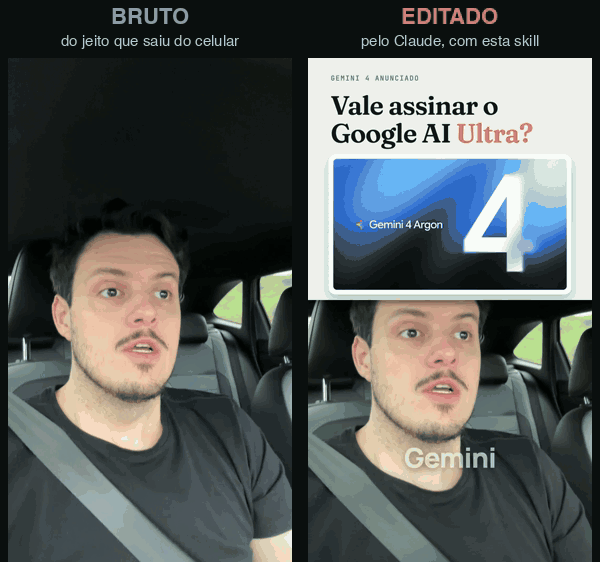
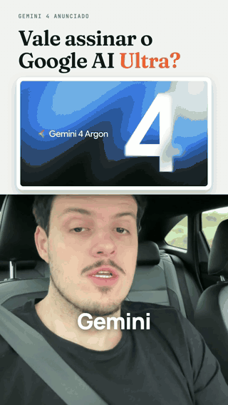
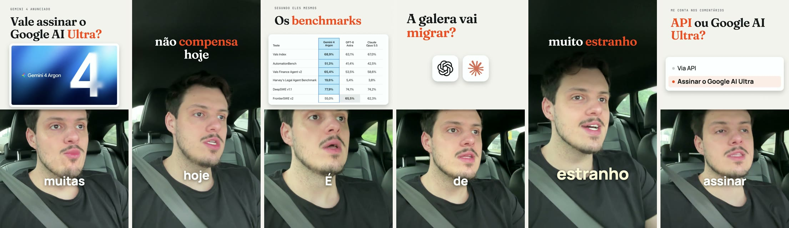

<div align="center">

# Seu editor de vídeo dentro do Claude.
### Manda o vídeo, o briefing e a referência. Recebe o reels editado.

Corte pela fala, legenda palavra a palavra, telas que entram na palavra certa e som pronto pro Instagram.<br>
**Tudo no seu computador, Mac ou Windows. Sem pagar por minuto. Sem saber editar.**




[**Começar com IA (sem saber editar)**](#-comece-em-3-passos-com-a-ia) · [**Passo a passo completo**](docs/README.md) · [**Ver as receitas**](#-as-receitas)

<sub>Open-source AI video editor for Claude Code · cuts on speech, word-by-word captions, scenes anchored to what you say · runs locally on macOS and Windows</sub>

     

</div>

---

## ✨ O que você recebe pronto

| | | |
|---|---|---|
| ✂️ **Corte que não come palavra**<br>Pausa, tropeço e repetição saem. O corte só cai em pausa de verdade, medida no áudio. | 💬 **Legenda palavra a palavra**<br>No tempo exato da fala, abaixo do queixo, longe da interface do Instagram. | 🎯 **Telas na palavra certa**<br>Print, número, card e logo entram quando você diz, não num segundo chutado. |
| 📱 **Tela dividida com rosto grande**<br>O assunto em cima, você embaixo, sem ficar minúsculo no celular. | 🔊 **Som pronto pro Instagram**<br>Voz limpa e nivelada, efeito discreto nas entradas, volume no padrão das redes. | 🔍 **Conferência antes de te mostrar**<br>A IA reouve o vídeo final e corrige sílaba comida e tela vazia. |
| 🎬 **Copia o jeito da sua referência**<br>Manda o link: ela mede o ritmo, a legenda e o layout e segue. | 🔁 **Ajuste em português**<br>"Legenda mais pra cima", "tira esse pedaço". Mexe só no que você pediu. | 🔒 **Nada sai do seu computador**<br>Transcrição e render rodam na sua máquina. Sem chave de API. |

## 🔁 Você só manda 3 coisas

| 🎥 Seu vídeo | 📝 Seu briefing | 🎯 Sua referência |
|---|---|---|
| O bruto do celular, do jeito que gravou. Pode ser em partes. | Do jeito que sair: sobre o que é, pra que serve, o que não pode aparecer. | Um link de reels que você queria que o seu parecesse. Ou um print. Ou nada. |
| [Como gravar melhor →](docs/03-gravar.md) | [O que contar →](docs/04-primeira-edicao.md) | [Como ela lê a referência →](docs/06-referencias.md) |

---

## 🚀 Comece em 3 passos com a IA

**Não precisa saber editar nem programar.** A IA conduz o mesmo processo que usamos para editar os nossos vídeos: lê a sua fala, mostra o plano, só corta depois do seu "pode" e confere tudo antes de te mostrar.

**1. Baixe o projeto e abra no Claude Code**
Clique em **Code > Download ZIP**, descompacte e abra a pasta no app [Claude Code](https://claude.com/claude-code). Precisa de um plano do Claude que inclua o Claude Code. Funciona em **Mac** e em **Windows 10/11** (no Windows, o Claude Code já usa o Git Bash, que é onde o editor roda).

**2. Cole esta frase na IA**
```text
Leia o COMECE-AQUI.md e prepare o meu editor de vídeo.
```
Ela confere o seu computador, instala o que faltar (pedindo permissão) e edita um vídeo de teste.

**3. Mande o seu vídeo**
```text
Edita esse vídeo: [arraste o vídeo aqui]. É sobre [assunto] e quero que [venda / ensine / seja compartilhado].
Referência: [link de um reels que você gosta]
```

Pronto. Ela lê a fala, lê a referência, te mostra o plano e entrega o vídeo editado.

> 💡 Quanto custa? O editor é grátis. Você só usa o seu plano do Claude. [Veja o que precisa](docs/02-pre-requisitos.md).

---

## 👀 Veja por dentro

O vídeo inteiro editado, acelerado (1min33 em 20 s):



As telas que entraram, cada uma na palavra em que foi dita:



<sub>Vídeo de exemplo: reels do Vinicius Parizotto (Grupo Nomics), bruto gravado no carro, editado do zero pela skill a partir de um pedido em português e de uma referência do Instagram.</sub>

---

## 🎬 As receitas

| Receita | Pra quê | Como fica |
|---|---|---|
| **Rosto e ideia** | opinião, tese, notícia comentada | você na tela toda, a frase forte aparecendo por cima, logo da marca que você cita |
| **Tela dividida** | explicar ferramenta ou método | o assunto em cima, você embaixo, um print por assunto entrando como carrossel |
| **Motion de produto** | lançamento, comparação, número | o gráfico domina, corte rápido, legenda com marca-texto |
| **Conversa crua** | bastidor, recado, papo | só você, grão de filme leve, poucas imagens presas com fita |
| **Bastidor de tela** | trabalho acontecendo | sua tela + seu rosto, pausas fora, etapas numeradas |

Não sabe qual? Não escolha: a IA sugere pela sua fala e pela sua referência. [Detalhe de cada receita →](docs/05-receitas.md)

---

## 🆘 Travou? A IA te ajuda

Cole no Claude:
```text
Travei em [onde]. O que apareceu foi: [cola a mensagem ou conta o que aconteceu].
Rode o diagnóstico do projeto, leia o resultado e me ajude a resolver passo a passo, em linguagem simples.
```
O diagnóstico (`bash scripts/diagnostico.sh`) confere tudo e diz o que falta, sem mostrar nada pessoal. [Problemas comuns →](docs/09-problemas-comuns.md)

## 🔒 No seu computador

- O vídeo, a transcrição e o render ficam no seu computador. Nada é enviado para servidor de ninguém.
- A transcrição usa o Whisper rodando na sua máquina. Sem chave de API, sem cobrança por minuto.
- Para ler um link do Instagram, a IA usa o login do seu próprio navegador, só no seu computador, só para baixar a referência. No Windows, o Firefox é o mais garantido (Chrome e Edge às vezes protegem o login).
- As pastas `meus-videos/`, `minhas-referencias/`, `minha-marca/` e `edicoes/` nunca vão para o GitHub (estão no `.gitignore`).

## ✋ O que ele não faz (ainda)

Não publica nada por você. Não inventa número, print nem depoimento: se não está na sua fala ou na sua pasta, não entra. Efeito especial fora das telas prontas: a IA monta sob medida ou usa o catálogo aberto do [HyperFrames](https://github.com/heygen-com/hyperframes), [quando você pedir](docs/07-efeitos-extras.md).

---

## 📖 Como isto foi construído

O nosso gerador de criativos levou uma tarde para editar um vídeo com tela dividida, imagens de filme e inserções na tela. A pergunta foi: tem um jeito mais fácil? Daí saiu um editor que vive dentro do Claude e que hoje edita os nossos reels em 36 minutos de média, do bruto até o ajuste final.

Este repositório é a versão aberta desse editor, feita para a galera do **Nexum**: o mesmo processo (ler a fala, planejar, cortar no silêncio, ancorar cada tela na palavra, conferir antes de mostrar), com um visual neutro que você troca pelo seu.

Feito pelo [**Grupo Nomics**](https://gruponomics.com.br). Licença [MIT](LICENSE): use, adapte e compartilhe, mantendo o crédito.

<sub>Créditos: fontes Fraunces, Manrope e JetBrains Mono (SIL Open Font License) · logos de marcas de IA do pacote <a href="https://github.com/lobehub/lobe-icons">Lobe Icons</a> (MIT; as marcas pertencem aos donos) · transcrição com <a href="https://github.com/ml-explore/mlx-examples">MLX Whisper</a> e <a href="https://github.com/SYSTRAN/faster-whisper">faster-whisper</a> · render com <a href="https://playwright.dev">Playwright</a> e <a href="https://ffmpeg.org">ffmpeg</a>.</sub>
